# 資格スケジュール管理アプリ — システム設計ドキュメント

> 作成日: 2026-06-08  
> バージョン: 2.0.0

---

## 目次

1. [システム概要](#1-システム概要)
2. [技術スタック](#2-技術スタック)
3. [ER図](#3-er図)
4. [テーブル定義](#4-テーブル定義)
5. [画面遷移図](#5-画面遷移図)
6. [API エンドポイント一覧](#6-api-エンドポイント一覧)
7. [各画面のデータフロー・CRUD分析](#7-各画面のデータフローcrud分析)
8. [認証フロー](#8-認証フロー)
9. [権限・プランモデル](#9-権限プランモデル)

---

## 1. システム概要

資格試験の日程管理、受験予定管理、保有資格記録を行う Web アプリケーション。

```
┌─────────────────────────────────────────────────────────┐
│                    ユーザーブラウザ                          │
│  React 18 + TypeScript + Vite + TanStack Query v5        │
│  Tailwind CSS / FullCalendar / React Router v6           │
└──────────────────────┬──────────────────────────────────┘
                       │ HTTP/REST (JSON)
                       │ Vite Proxy → localhost:3001
┌──────────────────────▼──────────────────────────────────┐
│                   バックエンド API                          │
│  Express 4 + TypeScript + tsx (Node.js v20)              │
│  JWT認証 / express-rate-limit / helmet / morgan          │
└──────────────────────┬──────────────────────────────────┘
                       │ postgres.js (Connection Pool)
┌──────────────────────▼──────────────────────────────────┐
│              PostgreSQL (Neon / ローカル)                  │
│  16テーブル / インデックス / トランザクション                  │
└─────────────────────────────────────────────────────────┘
```

---

## 2. 技術スタック

| レイヤー | 技術 | バージョン |
|---|---|---|
| フロントエンド | React | 18 |
| フロントエンド | TypeScript | 5.4 |
| フロントエンド | Vite | 5 |
| フロントエンド | TanStack Query | v5 |
| フロントエンド | React Router | v6 |
| フロントエンド | Tailwind CSS | 3 |
| フロントエンド | FullCalendar | 6 |
| バックエンド | Node.js | v20 |
| バックエンド | Express | 4.19 |
| バックエンド | TypeScript (tsx) | 4.x |
| バックエンド | postgres.js | 3.4 |
| バックエンド | jsonwebtoken | 9 |
| バックエンド | bcryptjs | 3 |
| DB | PostgreSQL | 15 (Neon) |

---

## 3. ER図

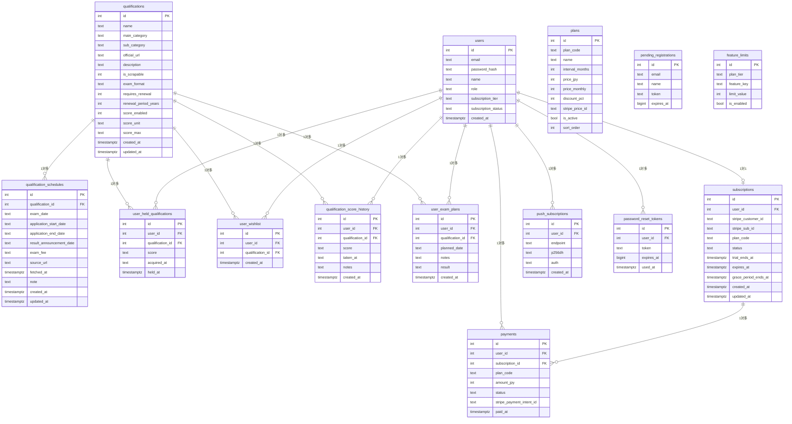

---

## 4. テーブル定義

### 4-1. qualifications（資格マスタ）

| カラム | 型 | 説明 |
|---|---|---|
| id | SERIAL PK | 資格ID |
| name | TEXT NOT NULL | 資格名 |
| main_category | TEXT | 大カテゴリ（国家資格/民間資格/公的資格） |
| sub_category | TEXT | 小カテゴリ（IT・情報/語学など） |
| official_url | TEXT | 公式サイトURL |
| description | TEXT | 説明文 |
| exam_format | TEXT | 試験形式（fixed_date/anytime/cbt/multiple） |
| requires_renewal | INT | 更新必要フラグ（0/1） |
| score_enabled | INT | スコア記録対応フラグ（0/1） |
| score_unit | TEXT | スコア単位（点/バンドスコアなど） |
| score_max | TEXT | 満点 |

### 4-2. qualification_schedules（試験日程）

| カラム | 型 | 説明 |
|---|---|---|
| id | SERIAL PK | スケジュールID |
| qualification_id | INT FK | 資格ID |
| exam_date | TEXT | 試験日（YYYY-MM-DD） |
| application_start_date | TEXT | 申込開始日 |
| application_end_date | TEXT | 申込締切日 |
| result_announcement_date | TEXT | 合格発表日 |
| exam_fee | TEXT | 受験料 |
| note | TEXT | 備考（テキスト形式の日程など） |
| fetched_at | TIMESTAMPTZ | 最終更新日時 |

> 1資格に対して複数スケジュールが登録可能（複数回試験対応）

### 4-3. users（ユーザー）

| カラム | 型 | 説明 |
|---|---|---|
| id | SERIAL PK | ユーザーID |
| email | TEXT UNIQUE | メールアドレス |
| password_hash | TEXT | bcryptハッシュ |
| name | TEXT | 表示名 |
| role | TEXT | ロール（admin/viewer） |
| subscription_tier | TEXT | プランティア（free/pro） |
| subscription_status | TEXT | サブスク状態（free/trial/premium） |

### 4-4. user_held_qualifications（保有資格）

| カラム | 型 | 説明 |
|---|---|---|
| user_id + qualification_id | UNIQUE | 複合ユニーク |
| score | TEXT | スコア（任意） |
| acquired_at | TEXT | 取得日（任意） |

### 4-5. user_exam_plans（受験予定）

| カラム | 型 | 説明 |
|---|---|---|
| planned_date | TEXT | 予定日（YYYY-MM-DD） |
| notes | TEXT | メモ |
| result | TEXT | 結果（passed/failed/null） |

> `result = 'passed'` 登録時、**自動で user_held_qualifications に INSERT**

### 4-6. subscriptions（サブスクリプション）

| カラム | 型 | 説明 |
|---|---|---|
| user_id | INT FK UNIQUE | ユーザーID（1対1） |
| plan_code | TEXT | プランコード（free/monthly/quarterly等） |
| status | TEXT | active/trial/canceled/expired |
| trial_ends_at | TIMESTAMPTZ | トライアル終了日 |
| expires_at | TIMESTAMPTZ | 有効期限 |
| grace_period_ends_at | TIMESTAMPTZ | 猶予期間終了日 |

### 4-7. plans（プラン定義）

| plan_code | 名前 | 期間 | 金額 | 割引 |
|---|---|---|---|---|
| monthly | 月額プラン | 1ヶ月 | ¥480 | 0% |
| quarterly | 3ヶ月プラン | 3ヶ月 | ¥1,380 | 4% |
| biannual | 6ヶ月プラン | 6ヶ月 | ¥2,640 | 8% |
| annual | 年額プラン | 12ヶ月 | ¥4,560 | 21% |

### 4-8. feature_limits（機能上限）

| 機能キー | free上限 | premium上限 |
|---|---|---|
| max_held_qualifications | 5件 | 無制限 |
| max_wishlist | 10件 | 無制限 |
| max_exam_plans | 3件 | 無制限 |
| max_score_history_per_qual | 5件 | 無制限 |
| push_notification_types | 1種 | 無制限 |
| calendar_export | 無効 | 有効 |
| data_export | 無効 | 有効 |

---

## 5. 画面遷移図

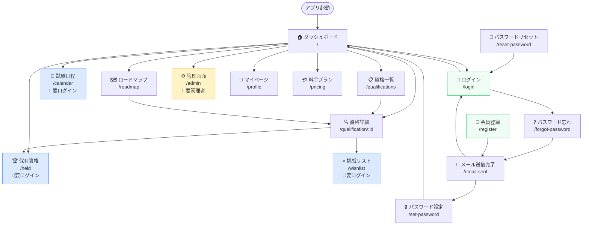

### 画面一覧

| # | パス | 画面名 | 認証要否 | 概要 |
|---|---|---|---|---|
| 1 | `/` | ダッシュボード | 不要 | 直近試験・申込期限・受験予定を表示 |
| 2 | `/qualifications` | 資格一覧 | 不要 | 全資格を検索・フィルター・並び替えで表示 |
| 3 | `/qualification/:id` | 資格詳細 | 不要（一部機能は要ログイン） | 試験スケジュール・受験予定・スコア管理 |
| 4 | `/calendar` | 試験日程 | ログイン必須 | FullCalendar で公式日程＋受験予定を表示 |
| 5 | `/held` | 保有資格 | ログイン必須 | 保有資格の一覧・取得日・スコア管理 |
| 6 | `/wishlist` | 挑戦リスト | ログイン必須 | 取得目標資格の管理 |
| 7 | `/roadmap` | ロードマップ | 不要 | 難易度別資格マップ |
| 8 | `/admin` | 管理画面 | 管理者のみ | 資格・スケジュール管理、CSVアップロード |
| 9 | `/profile` | マイページ | 不要 | プロフィール編集・アカウント管理 |
| 10 | `/pricing` | 料金プラン | 不要 | プラン選択・決済 |
| 11 | `/login` | ログイン | — | JWT認証 |
| 12 | `/register` | 会員登録 | — | メールアドレス入力 |
| 13 | `/email-sent` | メール送信完了 | — | 確認メール送信後画面 |
| 14 | `/set-password` | パスワード設定 | — | トークン検証後のパスワード設定 |
| 15 | `/forgot-password` | パスワード忘れ | — | リセットメール送信 |
| 16 | `/reset-password` | パスワードリセット | — | トークン検証後の再設定 |
| 17 | `/privacy` | プライバシーポリシー | — | 静的ページ |
| 18 | `/terms` | 利用規約 | — | 静的ページ |
| 19 | `/tokusho` | 特定商取引法 | — | 静的ページ |
| 20 | `/support` | サポート | — | 静的ページ |

---

## 6. API エンドポイント一覧

### 認証 `/api/auth`

| メソッド | パス | 認証 | 概要 |
|---|---|---|---|
| POST | /login | — | ログイン → JWT返却 |
| POST | /signup | — | 会員登録Step1（メール送信） |
| POST | /verify-token | — | 登録トークン検証 |
| POST | /complete | — | アカウント作成・トライアル開始 |
| GET | /me | JWT | ログインユーザー情報取得 |
| PATCH | /me | JWT | 名前変更 |
| DELETE | /me | JWT | アカウント削除 |
| POST | /forgot-password | — | パスワードリセットメール送信 |
| POST | /reset-password | — | パスワードリセット実行 |
| GET | /users | Admin | ユーザー一覧 |
| DELETE | /users/:id | Admin | ユーザー削除 |

### 資格 `/api/qualifications`

| メソッド | パス | 認証 | 概要 |
|---|---|---|---|
| GET | / | — | 資格一覧（検索・フィルター対応） |
| GET | /categories | — | カテゴリ一覧 |
| GET | /:id | — | 資格詳細（スケジュール含む） |

### カレンダー `/api/calendar`

| メソッド | パス | 認証 | 概要 |
|---|---|---|---|
| GET | /events | — | 全試験イベント取得 |

### 保有資格 `/api/held`

| メソッド | パス | 認証 | 概要 |
|---|---|---|---|
| GET | / | JWT | 保有資格IDリスト |
| GET | /details | JWT | 保有資格詳細（スコア・取得日含む） |
| POST | /:id | JWT | 保有資格トグル（追加/削除） |
| PATCH | /:id/score | JWT | スコア更新 |
| PATCH | /:id/acquired-at | JWT | 取得日更新 |
| PUT | /sync | JWT | 一括同期 |

### 受験予定 `/api/plans`

| メソッド | パス | 認証 | 概要 |
|---|---|---|---|
| GET | / | JWT | 全受験予定一覧 |
| GET | /qualification/:qualId | JWT | 資格別受験予定 |
| POST | / | JWT | 受験予定追加 |
| PATCH | /:id | JWT | 受験予定更新 |
| PATCH | /:id/result | JWT | 結果記録（合格→自動保有追加） |
| DELETE | /:id | JWT | 受験予定削除 |

### スコア履歴 `/api/scores`

| メソッド | パス | 認証 | 概要 |
|---|---|---|---|
| GET | /:qualId | JWT | スコア履歴取得 |
| POST | /:qualId | JWT | スコア追加 |
| DELETE | /:id | JWT | スコア削除 |

### 管理 `/api/admin`（管理者のみ）

| メソッド | パス | 認証 | 概要 |
|---|---|---|---|
| GET | /qualifications | Admin | 資格一覧（管理用） |
| POST | /qualifications | Admin | 資格追加 |
| PUT | /qualifications/:id | Admin | 資格更新 |
| DELETE | /qualifications/:id | Admin | 資格削除 |
| PUT | /schedules/:qualId | Admin | スケジュール更新（既存1件） |
| POST | /schedules/:qualId | Admin | スケジュール追加 |
| PUT | /schedules/record/:id | Admin | スケジュール個別更新 |
| DELETE | /schedules/record/:id | Admin | スケジュール個別削除 |
| POST | /upload-schedule | Admin | CSVバッチアップロード |

---

## 7. 各画面のデータフロー・CRUD分析

---

### 7-1. ダッシュボード（`/`）

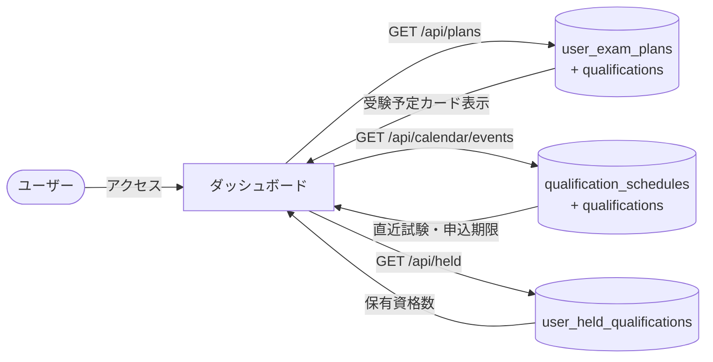

**CRUD分析**

| テーブル | C | R | U | D | 操作内容 |
|---|:---:|:---:|:---:|:---:|---|
| qualifications | — | ✅ | — | — | 直近試験の資格名表示 |
| qualification_schedules | — | ✅ | — | — | 直近試験日・申込期限取得 |
| user_exam_plans | — | ✅ | — | — | ログインユーザーの受験予定一覧 |
| user_held_qualifications | — | ✅ | — | — | 保有資格数カウント |

---

### 7-2. 資格一覧（`/qualifications`）

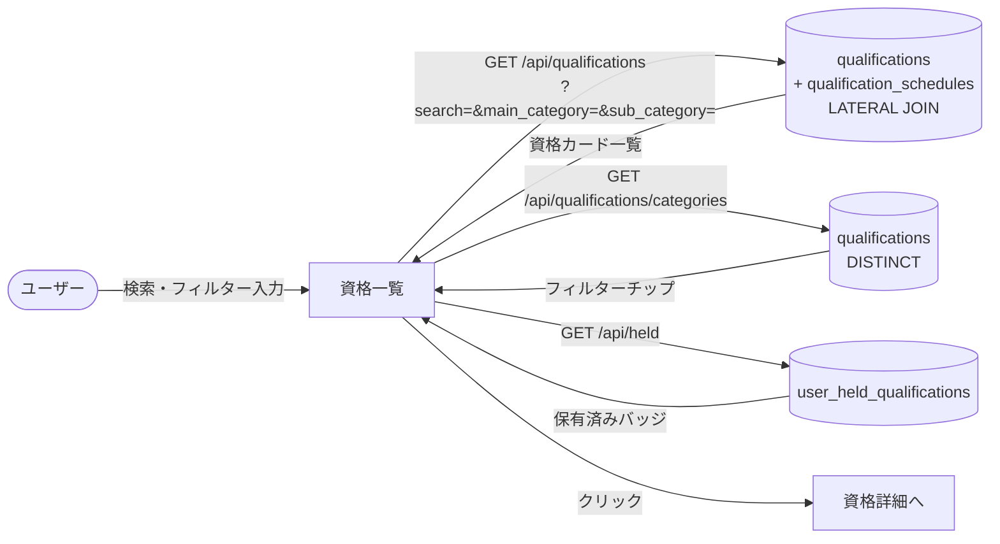

**CRUD分析**

| テーブル | C | R | U | D | 操作内容 |
|---|:---:|:---:|:---:|:---:|---|
| qualifications | — | ✅ | — | — | 全資格一覧（LATERAL JOIN で最新日程付き） |
| qualification_schedules | — | ✅ | — | — | 直近試験日表示（LATERAL JOIN） |
| user_held_qualifications | — | ✅ | — | — | 保有済みマーク表示 |

**特記事項**
- `LATERAL JOIN` で各資格の最新スケジュール1件のみ取得（パフォーマンス最適化）
- カテゴリフィルターは `DISTINCT` クエリで動的生成
- PC: `flex-wrap` で全チップ表示、モバイル: 横スクロール

---

### 7-3. 資格詳細（`/qualification/:id`）

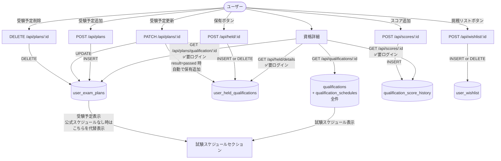

**CRUD分析**

| テーブル | C | R | U | D | 操作内容 |
|---|:---:|:---:|:---:|:---:|---|
| qualifications | — | ✅ | — | — | 資格情報取得 |
| qualification_schedules | — | ✅ | — | — | 全スケジュール取得 |
| user_held_qualifications | ✅ | ✅ | ✅ | ✅ | 保有トグル・スコア更新・取得日更新 |
| user_wishlist | ✅ | ✅ | — | ✅ | 挑戦リストトグル |
| user_exam_plans | ✅ | ✅ | ✅ | ✅ | 受験予定CRUD |
| qualification_score_history | ✅ | ✅ | — | ✅ | スコア記録・削除 |

**特記事項**
- 公式スケジュールが未登録の場合、受験予定をスケジュールセクションに代替表示
- `result = 'passed'` 記録時 → `user_held_qualifications` に自動 INSERT（合格→自動保有追加）
- `申込終了` ステータス: `application_end_date < today` で判定しオレンジバナー表示
- 無料プランの上限: 保有5件・受験予定3件・スコア5件/資格

---

### 7-4. 試験日程カレンダー（`/calendar`）

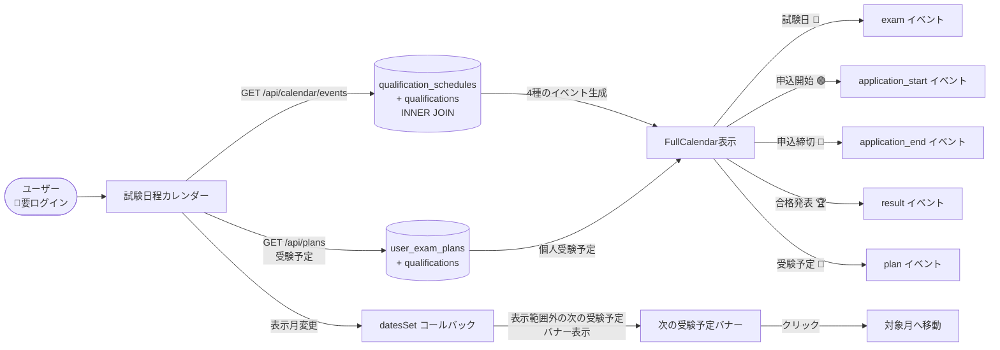

**CRUD分析**

| テーブル | C | R | U | D | 操作内容 |
|---|:---:|:---:|:---:|:---:|---|
| qualifications | — | ✅ | — | — | イベントタイトル用資格名取得 |
| qualification_schedules | — | ✅ | — | — | 全試験日程イベント生成 |
| user_exam_plans | — | ✅ | — | — | 個人受験予定イベント生成 |

**イベント色定義**

| イベント種別 | 表示 | 用途 |
|---|---|---|
| 試験日 | 📝 紺色 | 本試験日 |
| 申込開始 | 🟢 緑色 | 申込受付開始 |
| 申込締切 | 🔴 赤色 | 申込締切（重要） |
| 合格発表 | 🏆 黄色 | 合格発表日 |
| 受験予定 | 📌 ティール | ユーザー個人の予定 |

---

### 7-5. 保有資格（`/held`）

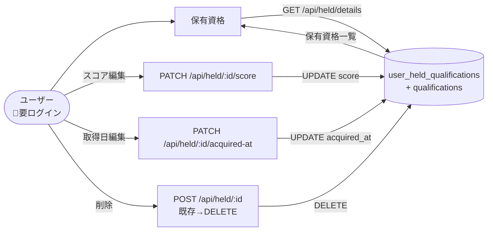

**CRUD分析**

| テーブル | C | R | U | D | 操作内容 |
|---|:---:|:---:|:---:|:---:|---|
| user_held_qualifications | — | ✅ | ✅ | ✅ | 一覧・スコア更新・取得日更新・削除 |
| qualifications | — | ✅ | — | — | 資格名・カテゴリ表示 |

---

### 7-6. 挑戦リスト（`/wishlist`）

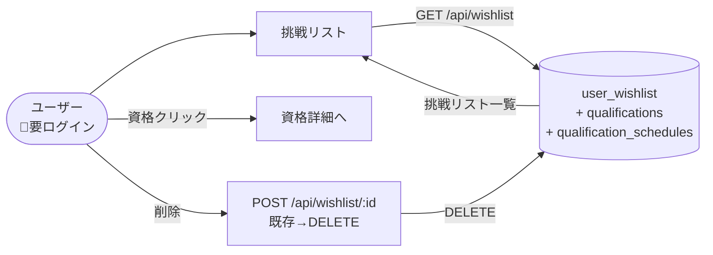

**CRUD分析**

| テーブル | C | R | U | D | 操作内容 |
|---|:---:|:---:|:---:|:---:|---|
| user_wishlist | — | ✅ | — | ✅ | 一覧・削除（追加は資格詳細から） |
| qualifications | — | ✅ | — | — | 資格名・カテゴリ表示 |
| qualification_schedules | — | ✅ | — | — | 直近試験日表示 |

---

### 7-7. 管理画面（`/admin`）

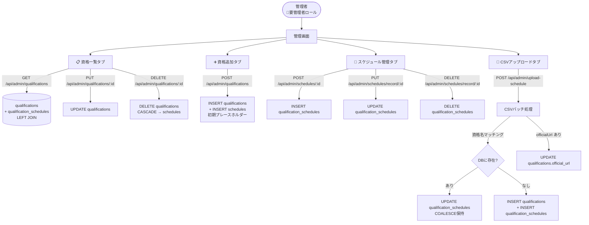

**CRUD分析**

| テーブル | C | R | U | D | 操作内容 |
|---|:---:|:---:|:---:|:---:|---|
| qualifications | ✅ | ✅ | ✅ | ✅ | 全CRUD |
| qualification_schedules | ✅ | ✅ | ✅ | ✅ | 全CRUD（複数日程対応） |

**CSVアップロード仕様**

```
列構成（8列）:
  資格名称, 試験日, 申込開始日, 申込締切日, 合格発表日, 受験料, 公式URL（省略可）, 情報状態（無視）

処理ロジック:
  1. 全資格・全スケジュールを事前一括取得（DB往復を 4N→2回 に削減）
  2. 資格名でマッチング
     ├─ 既存資格あり → スケジュールUPDATE（COALESCE: 空セルは既存値保持）
     └─ 新規資格    → qualifications INSERT → schedules INSERT
  3. 公式URLがあれば qualifications.official_url も更新
  4. テキスト形式の日程（例: 毎月実施）は note フィールドへ保存
```

---

### 7-8. ログイン・認証フロー（`/login`）

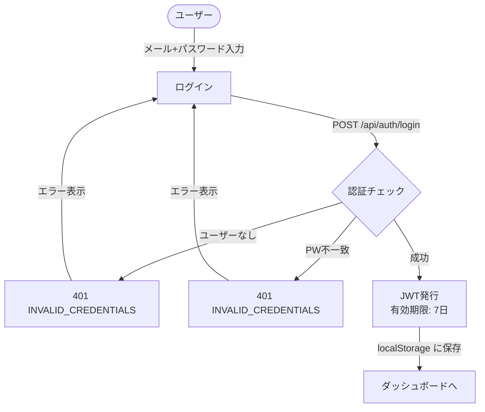

---

### 7-9. 新規会員登録フロー（`/register` → `/set-password`）

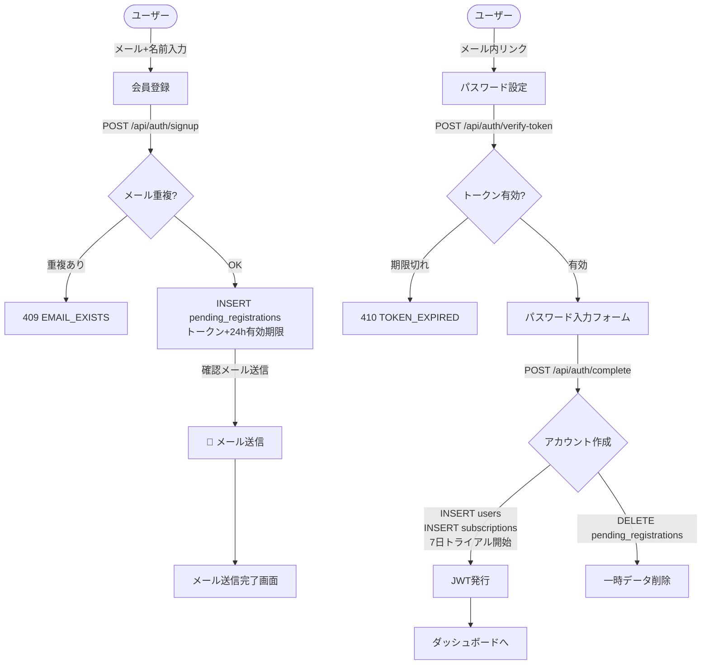

**CRUD分析（認証関連）**

| テーブル | C | R | U | D | 操作内容 |
|---|:---:|:---:|:---:|:---:|---|
| users | ✅ | ✅ | ✅ | ✅ | 作成・取得・名前変更・削除 |
| pending_registrations | ✅ | ✅ | — | ✅ | 仮登録作成・検証・削除 |
| password_reset_tokens | ✅ | ✅ | ✅ | — | 作成・検証・使用済みマーク |
| subscriptions | ✅ | ✅ | ✅ | — | 作成・取得・更新 |

---

## 8. 認証フロー

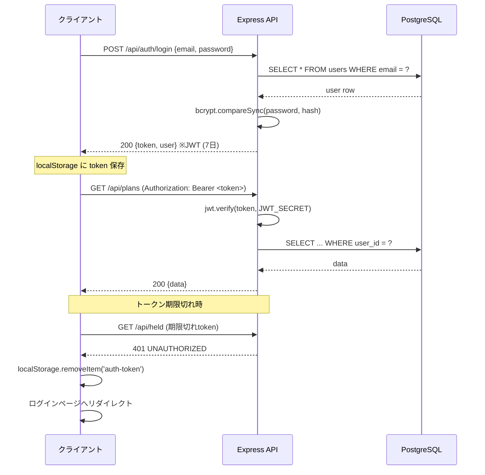

---

## 9. 権限・プランモデル

### 9-1. ロール

```
users.role
├── admin  → 管理画面アクセス可、全APIエンドポイント利用可
└── viewer → 一般ユーザー機能のみ
```

### 9-2. プランと機能制限フロー

```mermaid
flowchart TD
    REQUEST[API リクエスト] --> AUTH[requireAuth\nJWT検証]
    AUTH --> LIMIT[checkCountLimit\n件数上限チェック]
    LIMIT -->|feature_limits テーブル参照| CHECK{上限内?}
    CHECK -->|OK| PROCESS[処理実行]
    CHECK -->|超過| E[403 LIMIT_EXCEEDED\n{feature, max, message}]
    E -->|フロントエンド| PREMIUM_GATE[PremiumFeatureGate\nアップグレード誘導]
```

### 9-3. サブスクリプション状態遷移

```
new user
  └→ status: 'trial'   (7日間フリートライアル)
        ├→ 期限切れ → status: 'free' / subscription_status: 'free'
        └→ 決済完了 → status: 'active' / subscription_status: 'premium'
              ├→ 解約 → status: 'canceled'
              │      └→ 猶予期間後 → status: 'expired'
              └→ 更新 → status: 'active' (継続)
```

---

## 付録: インデックス一覧

| インデックス名 | テーブル | カラム | 用途 |
|---|---|---|---|
| idx_qual_main_category | qualifications | main_category | カテゴリフィルター |
| idx_qual_sub_category | qualifications | sub_category | カテゴリフィルター |
| idx_schedules_qual_id | qualification_schedules | qualification_id | JOIN高速化 |
| idx_users_email | users | email | ログイン検索 |
| idx_held_user_id | user_held_qualifications | user_id | ユーザー別保有資格 |
| idx_wishlist_user_id | user_wishlist | user_id | ウィッシュリスト |
| idx_score_history_user_qual | qualification_score_history | (user_id, qualification_id) | スコア検索 |
| idx_exam_plans_user_id | user_exam_plans | user_id | 受験予定 |
| idx_exam_plans_planned_date | user_exam_plans | planned_date | 日程順ソート |
| idx_subs_stripe_sub_id | subscriptions | stripe_sub_id | Webhook処理 |
| idx_subs_expires_at | subscriptions | expires_at | 有効期限チェック |
| idx_subs_grace_period | subscriptions | grace_period_ends_at | 猶予期間チェック |
| idx_users_subscription_status | users | subscription_status | プランフィルター |
| idx_push_subs_user_id | push_subscriptions | user_id | プッシュ通知 |
